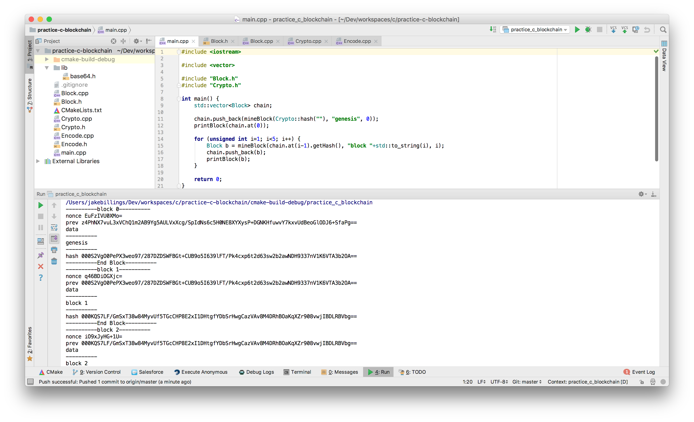

# practice-c-blockchain #

This repository contains my personal practice with C++ in preparation for CS classes at CU Denver. Since this repository is just a practice repo, it is lacking in best practices and documentation. See the python implementation in my `research-blockchain` repository for cleaner code.

### Blockchain ###
This implementation of a blockchain in C++ is based off of a simplified version of the Bitcoin mining algorithm. See [research-blockchain](https://github.com/jake-billings/research-blockchain) for more information on the algorithm. The purpose of this repository is to replicate that algorithm in C++.

### Other Projects ###
Checkout my other projects at [http://www.jakebillings.com](http://www.jakebillings.com) or contact me via [LinkedIn](https://www.linkedin.com/in/jake-billings/).